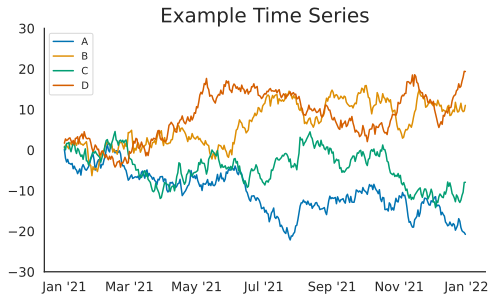
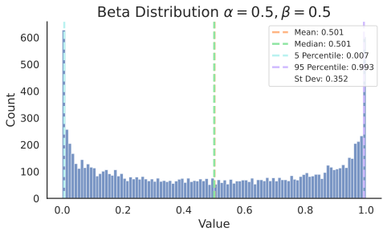

# not-again-ai

[![GitHub Actions][github-actions-badge]](https://github.com/DaveCoDev/not-again-ai/actions)
[![Code style: black][black-badge]](https://github.com/psf/black)
[![Imports: isort][isort-badge]](https://pycqa.github.io/isort/)
[![Type checked with mypy][mypy-badge]](https://github.com/python/mypy)

[github-actions-badge]: https://github.com/DaveCoDev/not-again-ai/workflows/python/badge.svg
[black-badge]: https://img.shields.io/badge/code%20style-black-000000.svg
[isort-badge]: https://img.shields.io/badge/%20imports-isort-%231674b1?style=flat&labelColor=ef8336
[mypy-badge]: https://img.shields.io/badge/type%20checked-mypy-blue.svg

Have you ever been working on a project and groaned as you go to search again on how to nicely plot a simple distribution? Or have you been frustrated at wanting to run multiple functions in parallel, but stuck between the seemingly ten different ways to do it?
**not-again-ai** is a Python package designed to once and for all collect all these little things that come up over and over again in AI projects and put them in one place.

**Documentation** available at [DaveCoDev.github.io/not-again-ai/](https://DaveCoDev.github.io/not-again-ai/).

# Installation

Requires: Python 3.9, 3.10

Install from [PyPI](https://pypi.org/project/not-again-ai/)

```bash
$ pip install not_again_ai
```

# Quick tour

## Visualization

We currently offer two visualization tools, a time series plot and a histogram for plotting univariate distributions.

```python
>>> import numpy as np
>>> import pandas as pd
>>> from not_again_ai.viz.time_series import ts_lineplot
>>> from not_again_ai.viz.distributions import univariate_distplot

# get some time series data
>>> rs = np.random.RandomState(365)
>>> values = rs.randn(365, 4).cumsum(axis=0)
>>> dates = pd.date_range('1 1 2021', periods=365, freq='D')
# plot the time series and save it to a file
>>> ts_lineplot(ts_data=values, save_pathname='myplot.png', ts_x=dates, ts_names=['A', 'B', 'C', 'D'])

# get a random distribution
>>> distrib = np.random.beta(a=0.5, b=0.5, size=1000)
# plot the distribution and save it to a file
>>> univariate_distplot(
...     data=distrib, 
...     save_pathname='mydistribution.svg', 
...     print_summary=False, bins=100, 
...     title=r'Beta Distribution $\alpha=0.5, \beta=0.5$'
... )
```

<p float="center">
  
   
</p>

## Parallel
For when you have functions you want to execute in parallel.

```python
# execute the passed in functions in parallel without any additional arguments
>>> result = embarrassingly_parallel_simple([do_something, do_something2], num_processes=2)

# execute the function mult in parallel with the passed in arguments
>>> args = ((2, 2), (3, 3), (4, 4))
>>> result2 = embarrassingly_parallel(mult, args, num_processes=multiprocessing.cpu_count())
```

## Filesystem
We provide helpers to deal with files and directories easily and without raising uncessary errors.

```python
>>> from not_again_ai.system.files import create_file_dir

# creates the directory mydir if it does not exist
>>> create_file_dir('mydir/myfile.txt')
```

# Development Information

This package uses [Poetry](https://python-poetry.org/) to manage dependencies and
isolated [Python virtual environments](https://docs.python.org/3/library/venv.html).

To proceed, 
[install Poetry globally onto your system](https://python-poetry.org/docs/#installation).

(Optional) configure Poetry to use an in-project virtual environment.
```bash
$ poetry config virtualenvs.in-project true
```

## Dependencies

Dependencies are defined in [`pyproject.toml`](./pyproject.toml) and specific versions are locked
into [`poetry.lock`](./poetry.lock). This allows for exact reproducible environments across
all machines that use the project, both during development and in production.

To install all dependencies into an isolated virtual environment:

> Append `--sync` to uninstall dependencies that are no longer in use from the virtual environment.

```bash
$ poetry install
```

To [activate](https://python-poetry.org/docs/basic-usage#activating-the-virtual-environment) the
virtual environment that is automatically created by Poetry:

```bash
$ poetry shell
```

To deactivate the environment:

```bash
(.venv) $ exit
```

To upgrade all dependencies to their latest versions:

```bash
$ poetry update
```

## Packaging

This project is designed as a Python package, meaning that it can be bundled up and redistributed
as a single compressed file.

Packaging is configured by:

- [`pyproject.toml`](./pyproject.toml)

To package the project as both a 
[source distribution](https://docs.python.org/3/distutils/sourcedist.html) and
a [wheel](https://wheel.readthedocs.io/en/stable/):

```bash
$ poetry build
```

This will generate `dist/not-again-ai-0.1.0.tar.gz` and `dist/not_again_ai-0.1.0-py3-none-any.whl`.

Read more about the [advantages of wheels](https://pythonwheels.com/) to understand why generating
wheel distributions are important.

## Publish Distributions to PyPI

Source and wheel redistributable packages can
be [published to PyPI](https://python-poetry.org/docs/cli#publish) or installed
directly from the filesystem using `pip`.

```bash
$ poetry publish
```

# Enforcing Code Quality

Automated code quality checks are performed using 
[Nox](https://nox.thea.codes/en/stable/) and
[`nox-poetry`](https://nox-poetry.readthedocs.io/en/stable/). Nox will automatically create virtual
environments and run commands based on [`noxfile.py`](./noxfile.py) for unit testing, PEP 8 style
guide checking, type checking and documentation generation.

> Note: `nox` is installed into the virtual environment automatically by the `poetry install`
> command above. Run `poetry shell` to activate the virtual environment.

To run all default sessions:

```bash
(.venv) $ nox
```

## Unit Testing

Unit testing is performed with [pytest](https://pytest.org/). pytest has become the de facto Python
unit testing framework. Some key advantages over the built-in
[unittest](https://docs.python.org/3/library/unittest.html) module are:

1. Significantly less boilerplate needed for tests.
2. PEP 8 compliant names (e.g. `pytest.raises()` instead of `self.assertRaises()`).
3. Vibrant ecosystem of plugins.

pytest will automatically discover and run tests by recursively searching for folders and `.py`
files prefixed with `test` for any functions prefixed by `test`.

The `tests` folder is created as a Python package (i.e. there is an `__init__.py` file within it)
because this helps `pytest` uniquely namespace the test files. Without this, two test files cannot
be named the same, even if they are in different subdirectories.

Code coverage is provided by the [pytest-cov](https://pytest-cov.readthedocs.io/en/latest/) plugin.

When running a unit test Nox session (e.g. `nox -s test`), an HTML report is generated in
the `htmlcov` folder showing each source file and which lines were executed during unit testing.
Open `htmlcov/index.html` in a web browser to view the report. Code coverage reports help identify
areas of the project that are currently not tested.

pytest and code coverage are configured in [`pyproject.toml`](./pyproject.toml).

To pass arguments to `pytest` through `nox`:

```bash
(.venv) $ nox -s test -- -k invalid_factorial
```

## Code Style Checking

[PEP 8](https://peps.python.org/pep-0008/) is the universally accepted style guide for
Python code. PEP 8 code compliance is verified using [Flake8](http://flake8.pycqa.org/). Flake8 is
configured in the `[tool.flake8]` section of `pyproject.toml`. Extra Flake8 plugins are also
included:

- `flake8-bugbear`: Find likely bugs and design problems in your program.
- `flake8-broken-line`: Forbid using backslashes (`\`) for line breaks.
- `flake8-comprehensions`: Helps write better `list`/`set`/`dict` comprehensions.
- `pep8-naming`: Ensure functions, classes, and variables are named with correct casing.
- `pyproject-flake8`: Allow configuration of `flake8` through `pyproject.toml`.

Some code style settings are included in [`.editorconfig`](./.editorconfig) and will be
configured automatically in editors such as PyCharm.

To lint code, run:

```bash
(.venv) $ nox -s lint
```

## Automated Code Formatting

Code is automatically formatted using [black](https://github.com/psf/black). Imports are
automatically sorted and grouped using [isort](https://github.com/PyCQA/isort/).

These tools are configured by:

- [`pyproject.toml`](./pyproject.toml)

To automatically format code, run:

```bash
(.venv) $ nox -s fmt
```

To verify code has been formatted, such as in a CI job:

```bash
(.venv) $ nox -s fmt_check
```

## Type Checking

[Type annotations](https://docs.python.org/3/library/typing.html) allows developers to include
optional static typing information to Python source code. This allows static analyzers such
as [mypy](http://mypy-lang.org/), [PyCharm](https://www.jetbrains.com/pycharm/),
or [Pyright](https://github.com/microsoft/pyright) to check that functions are used with the
correct types before runtime.


```python
def factorial(n: int) -> int:
    ...
```

mypy is configured in [`pyproject.toml`](./pyproject.toml). To type check code, run:

```bash
(.venv) $ nox -s type_check
```

See also [awesome-python-typing](https://github.com/typeddjango/awesome-python-typing).

### Distributing Type Annotations

[PEP 561](https://www.python.org/dev/peps/pep-0561/) defines how a Python package should
communicate the presence of inline type annotations to static type
checkers. [mypy's documentation](https://mypy.readthedocs.io/en/stable/installed_packages.html)
provides further examples on how to do this.

Mypy looks for the existence of a file named [`py.typed`](./src/not-again-ai/py.typed) in the root of the
installed package to indicate that inline type annotations should be checked.

## Continuous Integration

Continuous integration is provided by [GitHub Actions](https://github.com/features/actions). This
runs all tests, lints, and type checking for every commit and pull request to the repository.

GitHub Actions is configured in [`.github/workflows/python.yml`](./.github/workflows/python.yml).

## [Visual Studio Code](https://code.visualstudio.com/docs/languages/python)

Install the [Python extension](https://marketplace.visualstudio.com/items?itemName=ms-python.python) for VSCode.

Default settings are configured in [`.vscode/settings.json`](./.vscode/settings.json). This will enable flake8 and black formatting with consistent settings.

# Documentation

## Generating a User Guide

[Material for MkDocs](https://squidfunk.github.io/mkdocs-material/) is a powerful static site
generator that combines easy-to-write Markdown, with a number of Markdown extensions that increase
the power of Markdown. This makes it a great fit for user guides and other technical documentation.

The example MkDocs project included in this project is configured to allow the built documentation
to be hosted at any URL or viewed offline from the file system.

To build the user guide, run,

```bash
(.venv) $ nox -s docs
```

and open `docs/user_guide/site/index.html` using a web browser.

To build and serve the user guide with automatic rebuilding as you change the contents,
run:

```bash
(.venv) $ nox -s docs_serve
``` 

and open <http://127.0.0.1:8000> in a browser.

Each time the `main` Git branch is updated, the 
[`.github/workflows/pages.yml`](.github/workflows/pages.yml) GitHub Action will
automatically build the user guide and publish it to [GitHub Pages](https://pages.github.com/).
This is configured in the `docs_github_pages` Nox session.

## Generating API Documentation

This project uses [mkdocstrings](https://github.com/mkdocstrings/mkdocstrings) plugin for
MkDocs, which renders
[Google-style docstrings](https://www.sphinx-doc.org/en/master/usage/extensions/napoleon.html)
into an MkDocs project. Google-style docstrings provide a good mix of easy-to-read docstrings in
code as well as nicely-rendered output.

```python
"""Computes the factorial through a recursive algorithm.

Args:
    n: A positive input value.

Raises:
    InvalidFactorialError: If n is less than 0.

Returns:
    Computed factorial.
"""
```

## Misc

If you get a `Failed to create the collection: Prompt dismissed..` error when running `poetry update` on Ubuntu, try setting the following environment variable:

    ```bash
    export PYTHON_KEYRING_BACKEND=keyring.backends.null.Keyring
    ```

# Attributions
[python-blueprint](https://github.com/johnthagen/python-blueprint) for the Python package skeleton.
