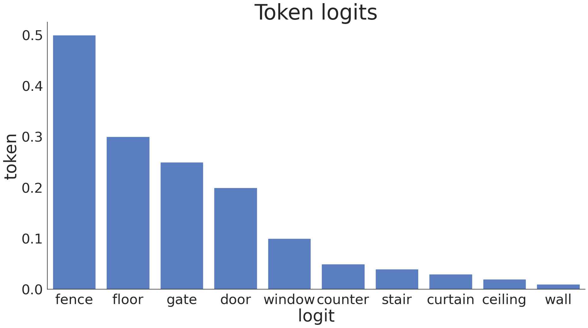
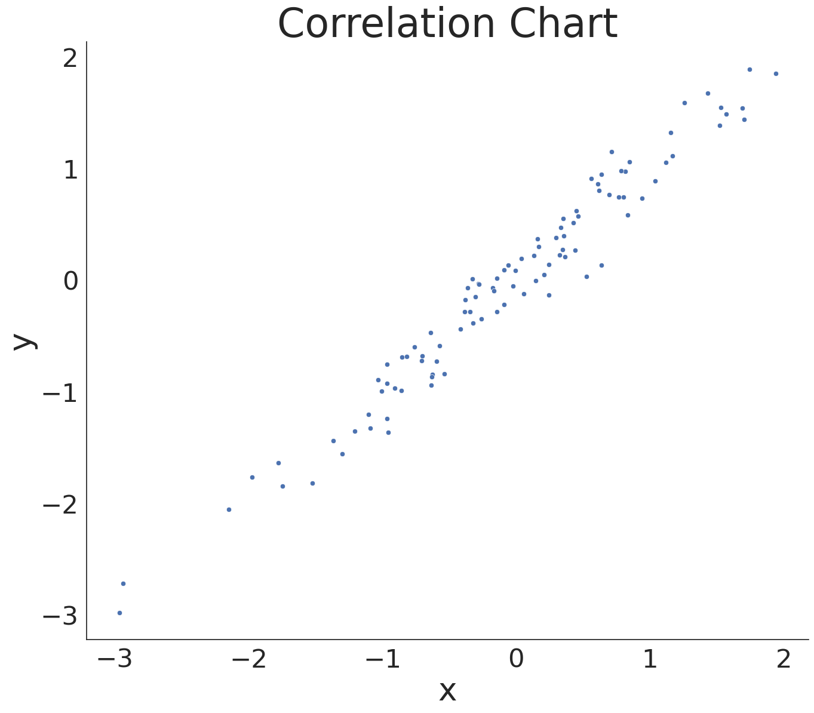

# Visualization
This module contains opinionated wrappers around [seaborn](https://seaborn.pydata.org/) to make common visualizations easier to create and customize.

## Bar Plots
### `simple_barplot`
Saves a simple barplot to the specified pathname given a list of values for the x-axis and a list of values for the y-axis. This function calls [seaborn.barplot](https://seaborn.pydata.org/generated/seaborn.barplot.html).

Example:

## Distributions
### `univariate_distplot`
Saves a univariate distribution plot to the specified pathname given a list of numbers. This function calls [seaborn.displot](https://seaborn.pydata.org/generated/seaborn.displot.html#seaborn.displot).

Example:

## Scatter Plots
### `scatterplot_basic`
Saves a basic scatterplot to the specified pathname given corresponding x and y values as lists. This function leverages [seaborn's scatterplot](https://seaborn.pydata.org/generated/seaborn.scatterplot.html).

Example:

## Time Series Plots
### `ts_lineplot`
Saves a time series plot where each row in `ts_data` is a time series.

Example:

